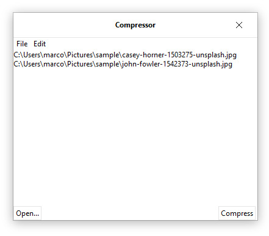
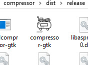
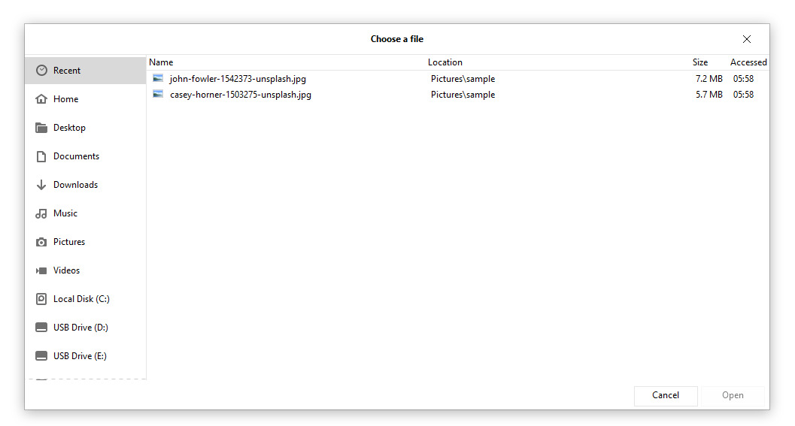
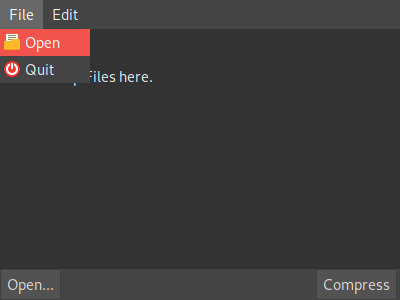
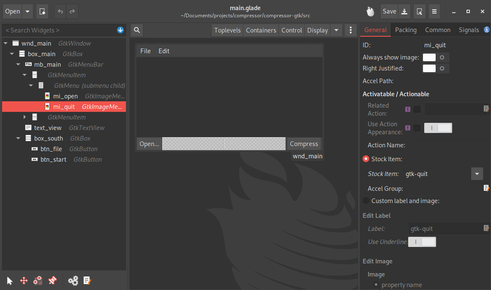

# compressor-gtk

A tiny utility to showcase the use of GTK+ 3 and rust on windows and linux.

This utility can resize a bunch of images selected via a file chooser of dropped by drag-and-drop.

The resize/compression settings are currently not implemented, the comanion crate [compressor](https://github.com/trimoq/compressor) supports them already.

Features:
- Drag-and-drop
- Uses GTK without directly using C or C++
- Runs on Linux and Windows
- Supports themes (compare screenshots from windows and linux below)
- Has a Gnome-Like file-chooser that nicely integrates with both supported OS
- The Windows-Release has no external dependencies except what is provided in the Zip-File

## Building
Build are run on (arch-)linux and maybe work on windows. Executables are crosscompiled to work on windows.

### For Linux
Ensure that gtk3 is installed in your system. How you do this depends on your distribution and you will most likely find a tutorial how to do this.

### For Windows
- Refer to [this tutorial](https://gtk-rs.org/docs-src/tutorial/cross) to set up your environment.
- Ensure you have set the `GTK_INSTALL_PATH` variable in the shell: e.g. `export GTK_INSTALL_PATH=/usr/x86_64-w64-mingw32`.
- Invoke cargo with `cargo build --release --target=x86_64-pc-windows-gnu`
- run `populate_release.sh` to package all dependencies into a zip that can be distributed to windows machines 

## Usage (on windows)
- Start the application  

  
- Drag files onto the main area !

  [Main UI](doc/dnd.jpg)
  
- ... or use the button and select files in the file chooser 
  
  
- Press start and wait a bit for the text to display that it is done.

- Your scaled images are in a `compressed` subfolder with the same names as the originals.

## Linux
Since the application is written in rust and uses GTK, which are both portable technologies, the tool works on linux too:

## Modify the UI
The UI is based on a glade-file, that can be edited with glade:

You can moove compentnts around without touching the code, as long as you don't change the IDs.

